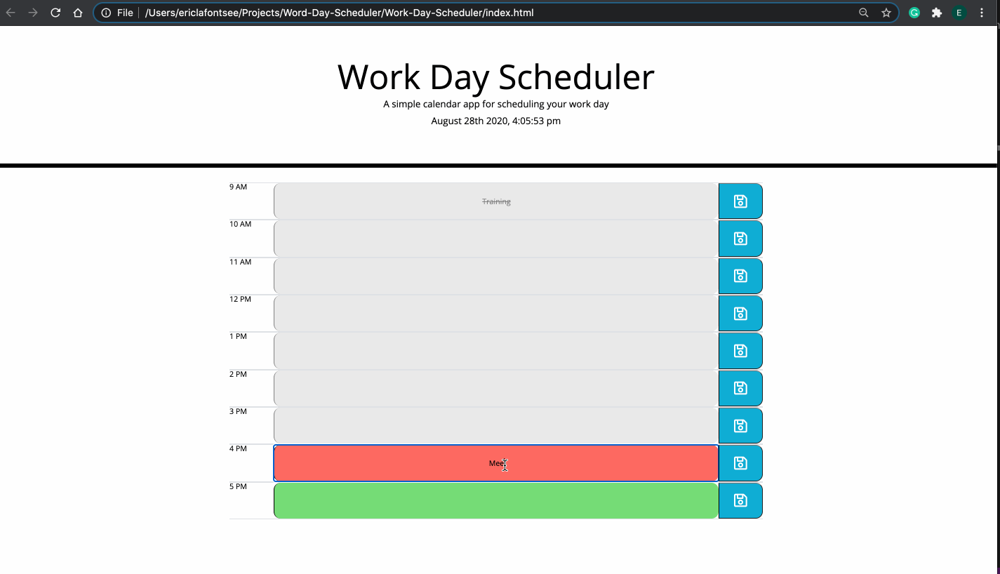

# Work-Day-Scheduler

## Description
For our homework assignment, we were asked to create a workday scheduler   
that is dynamically updated with jQuery. Events are color-coded based on   
the hour displayed at the top. Past events will be gray,  
present events will be red, and future events will be green. All events  
are saved to local storage so the user can exit the application and come   
back and their schedule is still saved.

This Work Day Scheduler is deployed to GitHub Pages:
https://ericlafontsee.github.io/Work-Day-Scheduler/

## Instructions
* Open scheduler
* To add an event, click the blank text area and begin typing your event title.
* After you have entered the event, click the save button located to the right.
* Repeat steps as needed.


## Usage



## Built With
HTML    
CSS    
jQuery  
BootStrap     
Font Awesome  
Google Fonts  
Moment.js  
Background image from www.subtlepatterns.com 

## Prerequisites
To build or edit this application you will need Visual Studio Code or a text editor

## Installation
To utilize the background image from www.subtlepatterns.com, download the background into your images folder. Then place the following in your css:

```css
 body {
  background-image: url("images/gplaypattern.png");
  background-repeat: repeat;
  background-position: center;
}
```

To utilize Moment.js, place the following script at the end of your HTML body:

```html
        <script src="https://cdnjs.cloudflare.com/ajax/libs/moment.js/2.24.0/moment.min.js"></script>

```
To utilize the jQuery library, place the following script at the end of your HTML body:

```html
            <script src="https://code.jquery.com/jquery-3.4.1.min.js"></script>

```
To utilize Font Awesome, insert the following link into the head of your html document:

```html
               <link rel="stylesheet" href="https://use.fontawesome.com/releases/v5.8.1/css/all.css"
        integrity="sha384-50oBUHEmvpQ+1lW4y57PTFmhCaXp0ML5d60M1M7uH2+nqUivzIebhndOJK28anvf" crossorigin="anonymous" />

```
To utilize Google Fonts, insert the following link into the head of your html document:

```html
                <link href="https://fonts.googleapis.com/css?family=Open+Sans&display=swap" rel="stylesheet" />

```

To utilize Bootstrap components, grid, and other styles, insert the following link into the head of your html document:

```html
    <link rel="stylesheet" href="https://stackpath.bootstrapcdn.com/bootstrap/4.5.2/css/bootstrap.min.css"
    integrity="sha384-JcKb8q3iqJ61gNV9KGb8thSsNjpSL0n8PARn9HuZOnIxN0hoP+VmmDGMN5t9UJ0Z" crossorigin="anonymous">
```

## Author
Eric LaFontsee - jQuery
Trilogy - CSS

## Contact
Email - elafontsee@gmail.com

## License
MIT License

## Acknowledgments
Anthony Cooper(Instructor) - For help with revisions and debugging of the javaScript.
